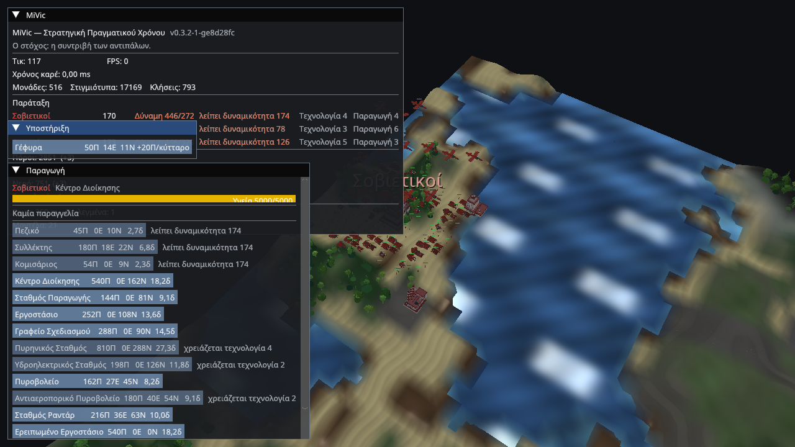
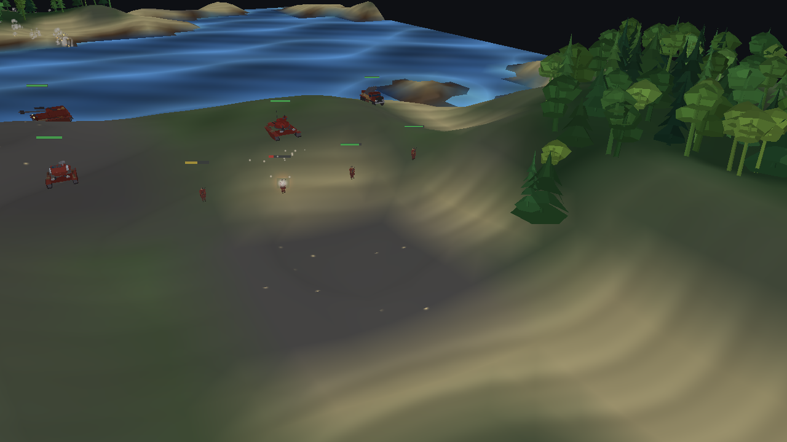
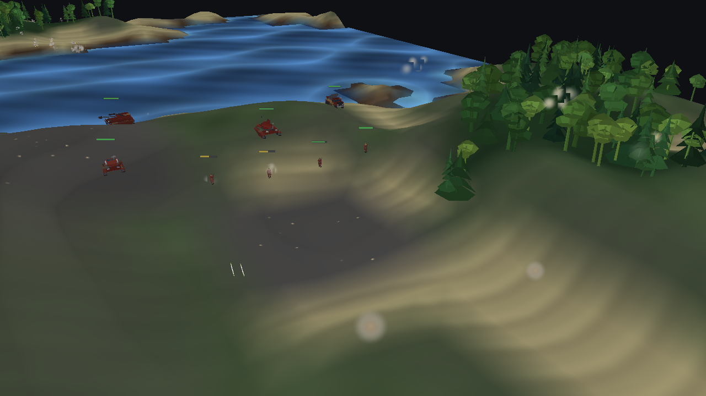
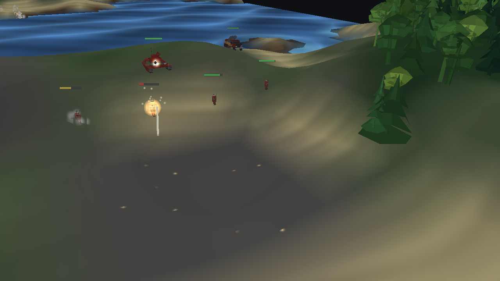
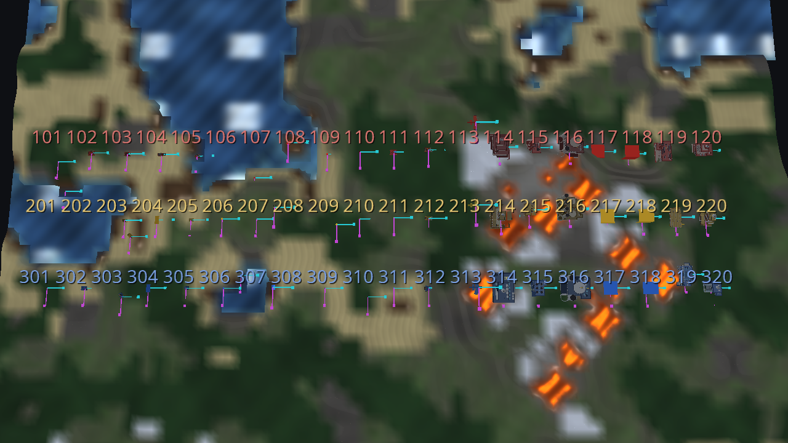
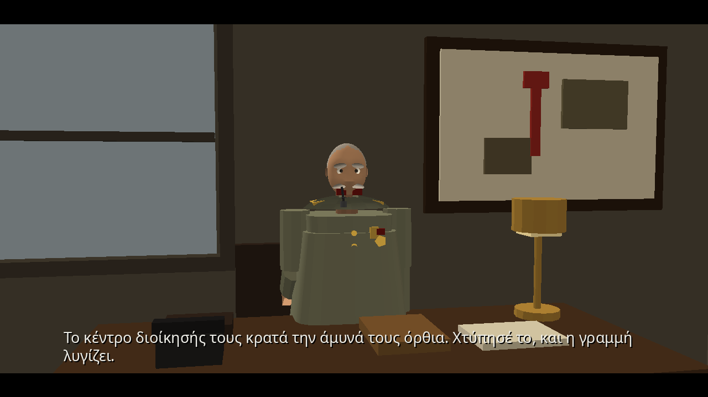

# MiVic

Ένα παιχνίδι στρατηγικής πραγματικού χρόνου (RTS) σε 3D, γραμμένο σε MonoGame,
στα ελληνικά. Σε ένα εναλλακτικό μέλλον όπου η Σοβιετική Ένωση υπάρχει ακόμη και
είναι σύμμαχος της Κίνας, ο στόχος είναι η ήττα της Δυτικής αυτοκρατορίας και η
οικοδόμηση ενός ειρηνικού, σοσιαλιστικού κόσμου.

A 3D real-time strategy game in MonoGame, with a Greek-language interface. Set in
an alternate future where the Soviet Union still exists and is allied with China;
the goal is the defeat of the Western empire.

**Release `v0.0.1`** — the first playable cut: three asymmetric factions, a full 3D
battlefield with mutable terrain, and shooting you can watch happen.



*Η σοβιετική βάση. Το πάνελ δείχνει την έκδοση της κατασκευής — `v0.0.1`, και ό,τι
ακολουθεί το τελευταίο tag (π.χ. `v0.0.1-3-g1a2b3c4` για μια κατασκευή τρεις
commits μετά την έκδοση).*

## Versioning / Εκδόσεις

The version is the **git tag**, not a number in a file:

```pwsh
git tag -a v0.0.2 -m "MiVic v0.0.2"
dotnet build MiVic.sln          # the build now calls itself v0.0.2
```

`Directory.Build.props` asks git for the nearest tag at build time and stamps it into
the assembly, which the window title and the status panel read back. A build that is
past a tag says so (`v0.0.1-3-g1a2b3c4`); a build from a tree with uncommitted changes
says that too (`v0.0.1-dirty`). A checkout with no tags at all is `v0.0.0` rather than
the SDK's default, which would look like a release.

## Screenshots

| | |
|---|---|
|  |  |
| **Μάχη.** Βολές, καπνός, θραύσματα. | **Γραμμή βολής.** Όλα τα όπλα του παιχνιδιού, με βλήματα στον αέρα. |
|  |  |
| **Έκρηξη.** Κύκλος κύματος κρούσης, χώμα, θραύσματα. | **Τα μοντέλα.** Όλα, παραγόμενα από σενάριο Blender. |
|  | |
| **Η ενημέρωση.** Μια σκηνή με κάμερα, υπότιτλους και δικό της θέμα. | |

Όλες οι εικόνες παράγονται από το ίδιο το παιχνίδι, χωρίς να παιχτεί χέρι:

```pwsh
$exe = "src/MiVic.Game/bin/Debug/net9.0/MiVic.Game.exe"
& $exe --combat-demo  --screenshot docs/images/firefight.png  --screenshot-frame 22
& $exe --fire-demo    --screenshot docs/images/firing-line.png --screenshot-frame 50
& $exe --model-gallery docs/images/models.png
python3 tools/render_cutscene.py --cutscene m1_briefing --out artifacts/cutscene
```

## Factions / Παρατάξεις

| | Σοβιετικοί | Κινέζοι | Δυτικοί |
|---|---|---|---|
| Παραγωγή | χαμηλή | πολύ υψηλή | υψηλή |
| Τεχνολογία | υψηλή | χαμηλή | πολύ υψηλή |
| Συνοχή / Ηθικό | ακλόνητο | υψηλό | εύθραυστο |
| Ιδιαίτερο | Σχεδιαστικό Γραφείο | Μαζική παραγωγή | Ηθικό ανά μονάδα |

Design rationale and the alternate-history tech tree are in
[docs/DESIGN.md](docs/DESIGN.md). What the ground is made of, and what it is becoming,
is in [docs/TERRAIN.md](docs/TERRAIN.md). What is planned but not built is in
[docs/ROADMAP.md](docs/ROADMAP.md). How to interrogate a running client without looking
at it — scripted queries, screenshots and checks in one process — is in
[docs/PROBE.md](docs/PROBE.md). What a skeptical pass over the whole project found,
including the defects it has since fixed, is in [docs/AUDIT.md](docs/AUDIT.md).

## Requirements

- .NET 9 SDK (the project also builds and tests with the .NET 10 SDK — the game
  and the test projects both roll forward, so a machine with only the .NET 10
  runtime can build the solution and run the suite)
- Windows, Linux or macOS with an OpenGL 3.3 capable GPU
- MonoGame content tools are restored automatically by the build

## Build and run

```pwsh
dotnet build MiVic.sln
dotnet test MiVic.sln                       # 712 tests: 643 core, 44 audio, 25 map

pwsh ./tools/fetch-assets.ps1               # optional: the old borrowed models, no longer used

# Optional: regenerate every model (needs Blender 5.x; the .glb files are committed)
pwsh ./tools/blender/build_all.ps1

dotnet run --project src/MiVic.Game
```

### Building on Linux

No Wine and no Windows SDK anywhere. The effects compile with the project's
own dotnet tool — `ShadowDuskCLI`, HLSL through DXC and SPIRV-Cross straight
to GLSL, natives shipped for every desktop platform — which the build runs
automatically from the tool manifest:

```sh
dotnet build MiVic.sln
```

The first build restores the tool (`dotnet tool restore` runs inside the
build). The compiled shaders land next to their sources and are not committed —
a build regenerates them when a `.fx` changes.

CI (`.github/workflows/ci.yml`) does exactly this on every push and pull
request, and then runs three gates: `dotnet test MiVic.sln`, every probe in the
repository through a virtual display, and `--selftest 600`, which is the
client's own verdict on Greek text, the symbol atlas, the health bars, the
replay round-trip and the frame budget. A `v*` tag publishes a versioned GitHub
release with self-contained portable archives for linux-x64 and win-x64
(`.github/workflows/release.yml`).

The probes and the self-test run under a scratch profile — `--probe` and
`--selftest` write to a temporary directory unless `--profile` names another —
so a test can never touch a player's real campaign.

### Command line

| Option | Effect |
|---|---|
| `--seed <n>` | simulation seed (default `20250101`) |
| `--font-size <px>` | UI font size (default 17) |
| `--no-help` | hide the controls panel |
| `--screenshot <file>` | render one frame to PNG and exit |
| `--screenshot-zoom/-yaw/-pitch/-target-x/-target-z` | camera overrides for verification shots |
| `--font-sample` | draw a large SpriteFont sample, for font diagnostics |
| `--selftest [frames]` | measure performance and check the client end to end, write `selftest-report.txt` next to the executable, exit non-zero on FAIL; run by CI |
| `--inspect-models` | headless model diagnostics, no GPU required |
| `--inspect-ui` | headless ImGui draw-data and font-atlas diagnostics |
| `--model-gallery <file>` | render every model with axis markers, for orientation checks |
| `--fullscreen` | start fullscreen (F11 toggles it at any time) |
| `--width <px>`, `--height <px>` | back-buffer size; the default 1280×720 is a size to play at, not to inspect a model at |
| `--screenshot-frame <n>` | which frame to capture; whether a round is in flight depends entirely on it |
| `--viewer` | model viewer: one model on a locked camera |
| `--viewer-model <Faction/Kind>` | which model the viewer opens on |
| `--viewer-shot <file>` | render one viewer frame to PNG and exit |
| `--viewer-distance <m>`, `--viewer-pitch <deg>`, `--viewer-angle <deg>` | viewer camera, for reproducible comparison shots |
| `--combat-demo` | a small battle already in weapon range, for looking at the shooting |
| `--fire-demo` | one of every weapon firing on a repeating cycle, so rounds can be photographed |
| `--particle-demo` | one of every effect, laid out in a grid |
| `--nuke-demo` | a tactical nuke, framed |
| `--select-hq` | select the player's command centre at start |
| `--victory-demo` | knock out the rival structures so the victory banner appears |
| `--objective-demo` | start the demonstration mission whose objectives the opening world has decided |
| `--paperclip-demo` | start the Operation Paperclip demonstration: a side the victory rule does not judge |
| `--generator-demo` | a derelict factory on neutral ground emitting its wardens on a fixed cadence (ROADMAP §9) |
| `--menu` | open the front-end menu even when another option drives the client, for screenshots of it |
| `--editor` | the map editor: raise and lower with a brush, paint surfaces, place structures **and units**, set an exact starting force, save and test-play (ROADMAP §10) |
| `--profile <dir>` | where the campaign's progress and saved matches live, instead of the platform default |
| `--record <file>` | log every external command and save the match as a replay |
| `--replay <file>` | verify a replay headlessly and exit (0 = the match was reproduced) |
| `--watch <file>` | play a recorded match back in the client |
| `--probe <script>` | run a probe script — scripted queries, screenshots and checks in one process — and exit |
| `--probe-out <file>` | where a probe writes its transcript (default `probe-report.txt`) |
| `--mission <id>` | start a campaign mission |
| `--mission-file <path>` | play a mission authored as a file (the `MissionFile` format; the loader runs the script validator and refuses one that cannot be won) |
| `--map-file <path>` | play an authored map: a seed, edits over the ground it generates, the starting force, and the mission the ground is shaped for (`MapFile`; the passes are re-derived and the placements asked the placement rules) |
| `--mission-list` | list the campaign |
| `--cutscene <id>` | play a scripted scene and carry on (see [Cutscenes](#cutscenes)) |
| `--render-audio <dir>` | export one WAV per faction theme and exit |
| `--render-sfx <dir>` | export one WAV per sound effect and exit |
| `--no-audio` | no music or sound effects |
| `--help` | usage |

The table is the options worth reading about; `--help` prints all 61. The fixture
flags are how a mechanic is put on screen without playing to it — `--rivals`
(Σοβιετικοί against Κινέζοι), `--duel`, and the `--alliance-demo`,
`--armour-demo`, `--detection-demo`, `--emplacement-demo`, `--flight-demo`,
`--forest-demo`, `--ground-demo`, `--lava-demo` and `--mud-demo` scenes behind
the probes. Two headless exports are also not in the table: `--render-scores`
and `--inspect-ui`.

### The menu, saving and loading

A plain launch opens the menu: **Συνέχεια** continues the campaign (the first mission not
yet won), **Νέα εκστρατεία** starts over, **Αποστολές** offers the missions the campaign has
decided, **Μάχη** is the skirmish, and **Φόρτωση** restores a saved match. Esc pauses, and
the pause panel carries **Αποθήκευση** — a save is a checkpoint a player makes on purpose:
the match's seed, scenario and command log up to the tick, restored by replaying forward.
Progress and saves live in the user's profile (`--profile <dir>` moves it; a probe or test
should always say so).

### Controls / Χειριστήρια

| Key | Action |
|---|---|
| `WASD` / arrows | pan |
| mouse wheel | zoom |
| `Q` / `E`, middle-drag | rotate |
| `Shift` + middle-drag | pan |
| left click | select a unit |
| left drag | box-select units |
| double click | select every unit of that kind on screen |
| `Shift` + click/drag | add to the selection |
| `Ctrl` + `1`…`9` | store the selection in a control group |
| `1`…`9` | recall a control group |
| right click | order selected units to move or attack |
| `F1` | toggle help panel |
| `M` | mute the music and effects |
| `F11` | toggle fullscreen |
| `Esc` | quit |

### Building / Παραγωγή

Production lives behind a selection: click one of your own buildings and the
**Παραγωγή** panel appears in the bottom-left corner with a button per unit that
building can make. Costs (`Π` materials, `Ε` energy) and build time in seconds are
on each button; a button is greyed out when the unit is locked behind a higher
tech tier or you cannot afford it. Jobs are queued, and the panel shows the queue
with the ticks left on the current item.

| Building | Produces |
|---|---|
| Κέντρο διοίκησης | πεζικό, and the structures |
| Εργοστάσιο | tanks, artillery, anti-air, aircraft |
| Σχεδιαστικό γραφείο | research projects that raise the tech tier |

With a design bureau selected, the same panel lists the research projects, and a
**Παραχώρηση άδειας** section hands one of your designs to the Κινέζοι — the
alliance's whole point, since a licensed unit bypasses their tech ceiling. When
nothing is selected the panel shows a short hint instead of disappearing.

## Project layout

| Project | Purpose |
|---|---|
| `src/MiVic.Core` | Deterministic simulation. **No graphics dependencies, no floating point.** |
| `src/MiVic.Audio` | Procedural chip music: scales, sequencing and synthesis. |
| `src/MiVic.Game` | MonoGame client: rendering, camera, ImGui UI, model import, particles. |
| `src/MiVic.Map` | Draws a match as a flat SVG/PNG picture from simulation state. **No graphics device**, so it runs from the probe, from a test, and on a machine with no GPU. |
| `tests/MiVic.Core.Tests` | Determinism, fixed-point maths, RNG, pathfinding, campaign and replay tests. |
| `tests/MiVic.Audio.Tests` | Music generation, scales and WAV encoding. |
| `tests/MiVic.Map.Tests` | The map writer: determinism of both formats, what each layer draws, and reading a PNG back. |

## Architecture rules

1. **The simulation is deterministic.** Integer millimetres for positions, Q16.16
   fixed point elsewhere, a fixed 20 Hz tick, and a PCG32 generator. No `float`,
   no `double`, no `System.Random`, no dictionary iteration in `MiVic.Core`.
2. **The client owns no game state.** It reads the simulation, interpolates
   between ticks for smooth motion, and submits instanced draws. Rendering can
   never change the outcome of a tick.
3. **Determinism is enforced by tests, not convention.** `DeterminismTests`
   contains golden hashes of a fixed scenario; if a system change alters the
   simulation, that test fails loudly.

## Status

Milestones **M0–M7 complete**: deterministic simulation core, heightmap terrain,
slope-aware A\* pathfinding, full-3D free camera, instanced rendering, Greek ImGui
UI, a glTF model pipeline, unit selection with move and attack orders, an economy
with the three factions' production systems, combat with the morale system,
licence production between allies, a deterministic AI opponent, per-team fog of
war, the victory and defeat conditions with a Greek end-of-match banner, recorded
replays that reproduce a match exactly, a three-mission campaign, a particle
system, and procedurally generated faction music.

| Metric | Value |
|---|---|
| Entities | 510 — 3 factions × (166 units + 4 structures) |
| Terrain | 129 × 129 samples over 600 m, 42 m relief |
| Surfaces | 9 types on the navigation lattice, generated from the seed |
| Navigation | 65 × 65 cells, slope- and surface-costed |
| Instanced draw calls | ~1 100 on the standard skirmish — one per model part in frame, not per unit, so a turret can aim |
| Frame time | ~3.2 ms average on the development machine; CI runs software rendering, so it reports no budget |
| Models imported | 49 configured slots (57 generated `.glb` files); 31 load in a skirmish |
| Pick round-trip | 170/170 |
| Tests | **712 passing** (643 core, 44 audio, 25 map) |

Every number in this table that a program can measure is now measured by one: the
entity, instance, draw-call, model, replay and pick figures come from `--selftest`,
which CI runs, so the table and the client cannot disagree without a red build.
The two it cannot measure — terrain relief and navigation resolution — are
constants in the simulation.

### Performance

Vision stamping is staggered across ticks (each unit contributes once every ten
ticks) and the A\* inner loop avoids integer divisions entirely; together those
took the worst visibility sample from 28 ms to under 8 ms.

Frame time is a property of the machine and the GPU, so the honest statement is
the one the self-test prints rather than a number in a table. On the development
machine a measured run averages ~3.2 ms with occasional 20–40 ms outliers that
land on an early simulation tick. Under CI's software rasteriser the average is
tens of milliseconds and the budget line reports `False`, which is why CI treats
the frame budget as information and the functional checks as the gate. The
self-test does report one cost worth watching on any machine: the **fog mask
rebuild** — 14 ms average, 26 ms worst in the software-rendered run — is a
periodic CPU and texture-upload stall every ten simulation ticks, and it is the
largest single thing the frame does outside the simulation. A 600-frame run
allocates ~84 MB and triggers nine gen-0 collections. See
[docs/DESIGN.md](docs/DESIGN.md#8-performance-what-a-hitch-actually-costs) and
[docs/AUDIT.md](docs/AUDIT.md).

`--selftest` used to be run by hand. It is now a CI step, which is how the
Linux-only crash it had carried (an unguarded `kernel32.dll` call) and the
unreadable SDL window title it reported were found and fixed.

### The campaign

Three missions, each exercising a different objective kind, with Greek briefings
and a live objectives panel (`--mission-list` prints them):

| Mission | Objective |
|---|---|
| `m1_bridgehead` — Το Προγεφύρωμα | destroy the Western command centre |
| `m2_ridge` — Η Κορυφογραμμή | hold the centre with six units for thirty seconds |
| `m3_industry` — Η Βιομηχανία της Νίκης | reach tech tier 3 and stockpile 4000 materials, keeping your HQ alive |

Objectives are declarative predicates evaluated twice a second, not scripted
callbacks, so a mission is as deterministic and replayable as a skirmish. A
mission replaces the last-team-standing rule: the objectives decide the outcome.

### Authoring a map's force

A mission's starting force is **generated**: the scenario searches for each
team's base, lays out a command centre, a power plant, a factory and (for a
side that gets one) a design bureau, and spawns a formation whose composition is
a fixed ratio — three tanks, an artillery piece, an anti-air vehicle, an
aircraft and six infantry per twelve.

A **map** can replace that with an authored one. `MapDefinition` carries two
placement lists — `structures` and `units`, one role and one exact position
each — and an `exactForce` flag:

- **`exactForce` false** (the default, and what every map did before the flag
  existed): the mission's generated layout is laid out, and the authored
  placements are added to it.
- **`exactForce` true**: the placements **are** the starting force. Nothing is
  generated for any team, so the map is exactly what is on it. The mission is
  still attached — its objectives, triggers and roster are what the map is
  played for — and each team in play still gets the standard opening stockpile,
  because authoring the order of battle is not the same decision as authoring
  the economy.

In the editor (`--editor`) a **Μονάδα** tool places units at the cursor and the
**Ακριβής σύνθεση** checkbox switches the mode; the panel counts what has been
placed, and the save refuses a force the loader would refuse. The rules are the
same ones a player's construction is asked: a structure needs ground it can be
founded on and must not overlap another, a unit needs ground its own movement
class can cross, and the loader checks that every judged side has a command
centre — a side that can neither build nor be beaten is not a side. Unlike the
generated formations, an authored position is never nudged to the nearest legal
cell: a file that names a spot means it, or it is refused with the reason.

`tools/probe/exact-force.probe` drives the whole path headlessly: three
headquarters and three units placed by name and coordinate, an invariant check
that six placements are six entities standing, and a save.

### Cutscenes

A mission can open on a **scripted scene**: a set, the figures standing in it, a
camera that moves between framings, and a monologue. Starting `m1_bridgehead`
from the menu plays its briefing first and starts the match when the scene ends;
`--cutscene <id>` plays one on its own, and `--menu` still opens the front end.

A scene is a file — `src/MiVic.Game/Content/Cutscenes/*.cutscene.json`, versioned
and validated like a mission or a map. It carries a set model, a cast, a camera
track in millimetres and milliseconds, and the lines in Greek with a duration
each. The loader refuses what a director could not play: no lines, a camera that
runs backwards, a line spoken by somebody who is not standing in the room.

The figures are **recognisable and unnamed**. The campaign is an alternate
history, and its statesmen are archetypes — a greatcoat, a moustache, a pipe —
who are never captioned and never name themselves or each other. That is a rule
of the fiction rather than a naming preference, and the asset names, the file
names and the script all keep it. Two Blender generators make the art:
`build_sets.py` (a room, open on the side the camera looks from) and
`build_personalities.py` (the figure).

The figure is built on the same parts contract as the soldiers, so the head and
arms can turn — and **round where a soldier is square**: cylindrical limbs, a
trunk that widens into a domed shoulder line, a coat that flares to a rounded hem,
and a head that is one warped surface rather than a stack of boxes. A soldier is
read at forty metres as a helmet and a shoulder line, and every corner he has
survives that; a personality is the whole frame at three metres, where every
corner is a corner.

The head is a sphere grid with a face warped into it — a brow shelf with sockets
cut under it, a nose that runs from between the brows to a tip and then turns back
in, cheeks, lips, a chin, the jaw narrowing towards it — and the eyes, brows,
moustache and ears are domes set into those features, each its own colour because
there is no texture on this renderer. The hair is the same surface pushed out,
with the hairline cut around the head: high over the brow and falling towards the
nape, which is what says "old" without a caption. The features are placed from the
head's own curve rather than by eye, because a moustache at the brow's height is a
moustache on the forehead.

`tools/blender/preview_model.py` draws a model from four sides in the Workbench
engine, with vertex colours and an orthographic camera: the same flat colours the
renderer stores, without the rebuild-probe-wait cycle that a scene render costs.

There are **no voices**: the words are typed on screen in Greek over the
faction's own procedural score (a briefing is scored by its own side). The
motion is deliberately small — a slow turn of the head, the breath of the arms
— because the figures are rigid parts with no skeleton, and a diorama that
gestures honestly reads better than one that pretends to perform. Space ends the
line being read, Esc skips the scene, and every line is also the transcript's.

`tools/probe/cutscene.probe` drives the whole thing in CI: it advances the
scene's clock explicitly so two runs photograph the same two moments, asserts
that the scene has something to draw and that a finished scene has said every
line it was written to say, and saves two frames. `tools/render_cutscene.py`
turns the same scene into MP4, GIF and a contact sheet with the subtitles burned
in: the frames come from the probe, which seeks rather than waits, and the words
are composited afterwards because the game puts them on screen through ImGui,
which a headless probe cannot draw.

### Particles

Explosions, smoke plumes and dust are CPU-simulated billboards drawn in two
instanced passes — additive for sparks, straight alpha for smoke and debris.
Deaths are reported by the simulation as events and turned into effects by the
client, which is strictly one-way: particles can never affect a tick, and an
enemy dying out of sight spawns nothing. Structures smoke in proportion to the
damage they have taken.

### Shooting

Damage is resolved on the tick a weapon fires, exactly as it always was — a round
on screen is a *picture* of a shot that has already happened, and giving rounds
real flight time would put them in the simulation, where they would change the
outcome of a tick and every recorded hash in the project.

The client finds the shots without being told: `CombatSystem` sets an entity's
attack cooldown to its weapon's reload only on the tick it actually fires, so a
cooldown that was zero last tick and is positive now, with a target, is a shot.
Each weapon then draws itself — a rifle a thin tracer, a tank gun a fat round with
a flash and a crack, a howitzer a shell thrown in an arc, the Κατιούσα four
wobbling rockets trailing smoke, anti-air twin rounds that burst in the air,
aircraft and drones missiles on smoke trails, the Ηλεκτροπυροβόλο an electric arc
between two points. Impacts match the weapon, and a wreck keeps exploding after it
dies.

Three things are drawn with their own geometry and their own pixel shader rather
than as billboards, because a billboard is the wrong shape for each of them: a
shockwave is an annulus, the body of a detonation is a low-poly sphere shaded from
its own facets, and a tracer is a streak shaded along its length.

`--combat-demo`, `--fire-demo`, `--particle-demo` and `--nuke-demo` exist to look
at all of this without playing a match; see [Screenshots](#screenshots).

### Terrain, water and lava

The ground is meshed from the simulation's own height field and surface layer, so
what is drawn is exactly what pathfinding reasons about. Water and lava are
separate surfaces drawn over it with their own shaders, animated from the frame
clock rather than from a texture — the only way a project with no authored assets
can have moving water. A separate mesh rather than a flag on the terrain's vertices,
because the terrain vertex alpha is already the faction paint mask and borrowing it
would let a team's colour bleed into the sea.

Nothing is ever built or spawned on water or lava. Produced structures and units are
placed at an offset from whatever made them, and that offset knows nothing about the
map — so every site is resolved to the nearest solid ground before the entity appears.
Without that, a factory on a shoreline eventually puts its next building in the lake,
and a structure in the sea is one the player cannot reach, defend or use.

**Bridges** are the way across. Building one spans the narrow way over the water and
converts the cells it crosses into the shallow-water ford surface that ground units
can already cross, capped by a maximum span so a bridge cannot be thrown over an
ocean.

### Music and sound effects

The soundtrack is generated, not recorded: no audio files ship with the game.
Each faction is written in its own musical tradition — the Σοβιετικοί get a
minor-key march with a harmonic-minor cadence, the Κινέζοι an anhemitonic
pentatonic song with grace notes, and the Δυτικοί a twelve-bar blues shuffle with
a boogie bass, backbeat and slightly detuned sawtooths. The generator is
deterministic, so a theme is reproducible and testable, and `--render-audio <dir>`
exports one WAV per faction for listening.

Combat audio comes from the same chip: rifle cracks, tank reports, artillery
launches, anti-air bursts, explosions, armour impacts, an alarm and a looping
engine, all rendered from noise and oscillators by `SoundBank` and exported with
`--render-sfx <dir>`. The client plays them at the position of the event, panned
by where it sits relative to the camera and attenuated by distance, with a budget
of six effects per frame so a five-hundred-unit battle cannot flood the mixer.
Impacts are detected by diffing entity health — the only reliable signal that a
shot landed, since a unit's cooldown also moves when it fails to find a target.
See [docs/DESIGN.md](docs/DESIGN.md#13-procedural-music).

### Fog of war

Each team has a visibility grid at navigation resolution: **visible** cells show
live enemy units, **explored** cells show remembered terrain, and everything else
is black. Enemies in cells the player cannot see are not drawn at all. The fog
itself is a terrain-shaped overlay textured by a per-team mask, not a grid of
dark tiles — see [docs/DESIGN.md](docs/DESIGN.md#11-fog-of-war-and-the-outcome-banner)
for why that distinction matters visually.

### Replays

A replay is the match's **inputs, not its state**: the seed, the scenario, the
entity capacity and every command the outside world issued, each stamped with the
tick it was issued on. Because the simulation is deterministic, replaying that
log into a fresh world reproduces the battle exactly — the file stores the state
hash it ended on, so verification is one comparison.

```
MiVic.Game.exe --record match.mvic          # play; the match is saved on exit
MiVic.Game.exe --selftest 600 --record m.mvic   # record headlessly
MiVic.Game.exe --replay match.mvic          # verify: exit code 0 means exact
MiVic.Game.exe --watch match.mvic           # watch it back
```

Commands the AI issues are deliberately **not** logged: the AI is part of the
simulation and re-derives its orders from the same state, so recording them would
apply each one twice. That keeps a 500-unit battle's replay at a few kilobytes.
`--selftest` records the live skirmish, replays it in-process and reports
`replay round-trip`, so a determinism regression fails the build rather than
showing up as a desync later. See
[docs/DESIGN.md](docs/DESIGN.md#12-replays-a-match-is-its-inputs).

### Probing a running client

A **probe** is a script of commands run against a live match in one process: advance the
simulation, ask what the world and the renderer are doing, photograph as many moments as
you like, and assert the answers.

```
tick 40
parts 509 turret        # where the gun points, from the renderer's own aim
events 4                # where the shots went
expect "the turret faces the shot" 33.7 33.7 0.2
```

```
MiVic.Game.exe --turret-demo --probe tools/probe/turret.probe --probe-out artifacts/probe/turret.txt
```

It exists because testing here used to be a process launch, one screenshot and a guess per
question, and most of this session's bugs were settled in seconds by a number that no
screenshot could have shown: which axis a rotating part turns about, whether a turret faces
the shot it fired, how many cells of each surface exist, how many of them are in frame. The
command set, the output format and worked transcripts are in
[docs/PROBE.md](docs/PROBE.md).

`tools/probe/base-ground.probe` is the same idea asked of the map: where each faction's base
ends up on the standard seed, and what the ground under it costs every movement class to
cross — which is how a base standing in a lake is told apart from one on a shore without
looking at either.

### Victory and defeat

`VictorySystem` decides the match on a fixed interval: the alliance wins when the
Δυτικοί have no structures left, the Δυτικοί win when the Σοβιετικοί and Κινέζοι
are both reduced to nothing, and a mutual wipe-out is a draw. The outcome is part
of the state hash, so it is as deterministic as the rest of the simulation. The
client shows a centred Greek banner over a dimmed battlefield: **ΝΙΚΗ**, **ΗΤΤΑ**
or **ΙΣΟΠΑΛΙΑ**, with the reason underneath.

### Combat and morale

Units auto-engage enemies in range and can be ordered onto a specific target,
which they will chase. Range is horizontal; only anti-air and aircraft can engage
aircraft. Morale — the Δυτικοί weakness — falls with local force balance and
recent casualties, scales reload speed by up to ×1.5, and below 0.25 sends a unit
**routing** away from the enemy until it rallies above 0.40.

Two Σοβιετικοί roles exist purely because of that asymmetry. The **Κατιούσα** is
rocket artillery: a harder-hitting, longer-ranged salvo than a howitzer, but the
impact point scatters up to 26 m off target and everything hostile inside 22 m
takes full damage — devastating against a formation or a building, poor against one
moving tank. The **Κομισάριος** is unarmed, cheap and worth killing: it steadies
the morale of friends around it. (Its stated initiative cost is not modelled yet.)

The **Κινέζοι** answer technology with automation. **Ρομποτικό Πεζικό** and
**Ντρόουν** are tier-3 hardware restricted to them alone: they have **no morale**,
so they never rout and get no morale-driven reload bonus either, and they cost
**energy instead of water** because there are no crews to feed. Drones fly, which
means terrain ignores them and only anti-air can engage them.

The **Δυτικοί** army is a bill. Propaganda costs one material per eight armed units
per tick and sets the morale baseline — **+0.10** while it is paid, **−0.20** when
it is not — and **Μισθοφόρος** contract infantry cost a wage every tick and
**down-tools** (routs, and will not fight) the moment the treasury cannot cover it.
The status panel shows the bill and says which obligation went unpaid.

### Terrain

The battlefield has nine surface types, generated from the world seed on the same
lattice as the navigation grid, so the same seed always produces the same mud in
the same place. Passability and cost are a lookup in permille of flat ground, with
zero meaning impassable, which is what lets the existing cost-driven A* pick
terrain up without changing its algorithm.

| | Γρασίδι | Λάσπη | Άμμος | Χιόνι | Βράχος | Ρηχό νερό | Βαθύ νερό |
|---|---|---|---|---|---|---|---|
| Πεζικό | 100 | 200 | 120 | 150 | 180 | 250 | — |
| Ερπύστριες | 100 | 250 | 150 | 180 | 180 | 300 | — |
| Τροχοφόρα | 100 | 300 | 160 | 200 | 180 | 450 | — |
| Αεροσκάφη | 100 | 100 | 100 | 100 | 100 | 100 | 100 |

Mud and snow are then scaled by the mover's **ground pressure**, which is where
the faction asymmetry becomes physical. A Σοβιετικοί tank runs at 750 ‰ of baseline
pressure — a light hull on wide tracks — against 1100 for Δυτικοί and 1250 for
Κινέζοι, so the same mud that costs a Soviet column 187 ‰ costs a Chinese one
312 ‰. That is the T-34 lesson: the *rasputitsa* hurt the invader more than the
defender, and the light hull kept moving where the heavies sank.

- **Deep water is impassable to everything on the ground** and irrelevant to
  aircraft. **Shallow water is a ford**: crossable, never cheap, and the reason a
  flooded map is still playable.
- **The generator guarantees a crossing.** Deep water can strand a unit on an
  island, and a unit that cannot path anywhere reads as a bug rather than as
  terrain. After classifying, the generator floods outward from the largest patch
  of ground and carves the narrowest gap to every stranded patch into a ford.
  Deterministic, and bounded: a patch walled off by cliffs rather than water is
  left alone instead of being retried forever.
- **Spawning respects it.** A unit whose spawn point lands in a lake is moved to
  the nearest free dry cell, and formations spread out instead of stacking on one
  point.
- **A\* is memoised per search.** A cell is looked at once as a node but up to
  eight times as a neighbour, so the surface lookup is cached; without that, adding
  terrain tripled the test suite's runtime.
- **The ground wears.** Driving over a cell churns it, by the mover's ground pressure, and it settles over time. Worn ground costs more, and the surcharge multiplies the cost a unit already pays — so the same churned field is a nuisance to infantry and a bog to a tank. A column of armour churns its own route and slows itself down, drawn as the ground darkening towards mud.
- **Research lightens it.** «Βαθιά Μάχη» multiplies the team's mud and snow penalty
  by 0.5, so a researched Σοβιετικοί tank runs at 375 ‰ of baseline ground pressure
  — the faction that handles mud best is the one that can research its way to
  ignoring it. The multiplier is per team, so an ally who never researches it still
  bogs down.

Still to come: the mud **churn** counter (wet ground driven over becomes deep mud),


### Health and damage at a glance

Anything damaged, and anything selected, gets a **health bar** floating over it: a
dark backing with a coloured fill that empties from the right — green, amber, red.
Bars are camera-facing quads drawn between the units and the fog, so a bar never
gives away a unit the player cannot see. A healthy unit nobody asked about gets no
bar at all, because a bar over every unit is noise.

`--selftest` reports how many bars were drawn, which is the check that damage
reached the interface and not only the simulation.

### Bridges and snow

A **Γέφυρα** button appears in the support panel once a faction has a factory.
Clicking it arms a placement and the next click on water spans it: the simulation
picks the narrow axis so a crossing actually crosses, converts the water along it
to a ford, and charges for the work. A site that is not water, too wide, or
unaffordable is refused **without charging** — a misplaced click costs nothing but
the click.

**Snow shortens sight** to 65 % for units standing in it. Snow blinds as well as
slows, so an advance through it is made nearly blind and scouting matters more.

### Off-map support

Abilities are data in `AbilityCatalog`, validated by `SimWorld.TryUseAbility`
(faction, era, prerequisite project, prerequisite structure, cooldown, cost) and
resolved in ascending slot order. The **Υποστήριξη** panel lists what your faction
can call in; clicking a button arms it and the next left-click on the ground is the
target.

| Ability | Era | Who | Prerequisite | Effect |
|---|---|---|---|---|
| Τροχιακό Πλήγμα | 3 | Σοβιετικοί | Κόκκινος Ουρανός + design bureau | 350 damage in 55 m, enemies only |
| Τακτικό Πυρηνικό Όπλο | 4 | Σοβιετικοί + Δυτικοί | a standing **Πυρηνικός Σταθμός** | 900 damage in 110 m, **friend and foe** |
| Έλεγχος Καιρού | 4 | Σοβιετικοί | Κόκκινος Λογισμός + design bureau | turns a 70 m area to **mud for 60 s** — no damage at all |

A nuke does not distinguish friend from foe; the orbital strike does, because it is
aimed. Losing the nuclear plant takes the capability away with it, which makes the
plant the first structure in the game whose value is not its income.

**Έλεγχος Καιρού** is the payoff of the whole ground-pressure system: the
Σοβιετικοί soak a 70 m stretch of ground into mud for sixty seconds, aimed at
whoever has the worst ground pressure. It deals no damage — the mud is the weapon.
Terrain is no longer a pure function of the seed, so the surface is part of the
state hash and the ground reverts exactly when the effect expires.

**Terrain is drawn as it is simulated.** The ground mesh takes its colour from the
simulation's own surface layer, so mud the player can see is mud the pathfinder
charges for, and water is flattened to the water line so lakes read as lakes rather
than as dark pits. The mesh is re-built from `TerrainLayer.Revision`, so a weather
control cast appears on the ground the moment it lands without meshing the terrain
every frame.

The **Καταδρομέας** is the Δυτικοί era-V edge: fast, hard-hitting, fragile, and
**invisible** to the enemy until it fires. A shot reveals it for five seconds, and
any enemy unit within 40 m detects it regardless — so stealth is a way to choose
your moment, not a way to become untouchable. Hidden units are neither targetable
nor drawn.

### The alliance and the AI

The Σοβιετικοί can **licence** a design to the Κινέζοι from their build panel. A
licensed unit bypasses the Chinese tech ceiling entirely, which is how the
alliance fields hardware the Κινέζοι could never research. An AI plays teams 1
and 2: it manages power, builds what it lacks, researches, grows an army, gathers
it, and attacks once it is large enough — all through the same commands a human
issues, so it stays inside the determinism contract.

### Economy and production

| | Σοβιετικοί | Κινέζοι | Δυτικοί |
|---|---|---|---|
| Parallel production slots | 4 | 6 | 3 |
| Build speed | ×1.10 | ×1.50 | ×0.80 |
| Unit cost | ×0.90 | ×0.70 | ×2.20 |
| Resource income | ×1.00 | ×0.90 | ×2.50 |
| Research speed | ×1.25 | ×0.70 | ×1.00 |
| Tech ceiling | 4 | 3 | 5 |

Resources are **Πόροι** (materials), **Ενέργεια** (energy) and **Νερό** (water).
Command centres produce materials and water, power plants produce energy and water,
and every other structure draws energy as upkeep — a team that cannot pay its
upkeep stops producing. Every construction job and every unit costs all three, paid
when it is queued, so a queue can never be filled with resources the team does not
have. **Income scales with the faction's wealth multiplier, upkeep does not**: the
Δυτικοί are rich rather than productive, so their bottleneck is factory time, never
money.

Σοβιετικοί factories cannot build a design directly. The design bureau must first
run a **prototype** — twice the cost and twice the build time, one at a time — which
approves the design for production and delivers the prototype itself as a real
unit. Infantry is exempt, because it comes from the command centre. This is the
faction's real weakness: the army **cannot pivot late**, because a design the bureau
has not proven is not available. Research runs at the design bureau and raises the
tech tier, which is what keeps the Κινέζοι out of the aircraft tier entirely.

### Roadmap

Next: a balance pass over the branched alternate-history tech tree, then campaign
scripting for scripted events between missions.

The AI already respects the fog for everything that moves: `AiSystem` will not
order an attack on a mobile enemy the team cannot see, and it asks the same
visibility grid the client draws. What it deliberately knows is **where enemy
buildings stand** — a structure does not move, so an order against one is an
order against a place, and requiring live eyes on a base six hundred metres away
would mean no army could ever be sent. Giving it a scouting memory of its own is
a feature, not a bug fix, and it is on the list. (This entry used to read "make
the AI respect fog of war (it currently plans against the whole map)", which had
stopped being true.)

## Greek text

Greek needed four separate fixes, all now verified automatically by `--selftest`
(see [docs/DESIGN.md](docs/DESIGN.md#8-greek-text--four-problems-all-solved)):

- ImGui glyph ranges must include Greek and Coptic.
- ImGui's atlas uses **straight** alpha, so it needs `BlendState.NonPremultiplied`.
  MonoGame's `AlphaBlend` is premultiplied and draws every glyph as a white box.
- The window title must be set *after* the window exists, because
  `SDL_CreateWindow` marshals its title argument as ANSI.
- The `.spritefont` needs explicit Greek character regions.

The UI font is [Noto Sans](https://fonts.google.com/noto) (SIL OFL), used both asa runtime TTF for ImGui and, compiled through the content pipeline, as
`Content/Fonts/UiText.spritefont` for world-space labels.

### Symbols

A glyph range is only half of it. A symbol from a block the font has no glyph in is drawn as the
same box a missing Greek letter is, and — unlike a missing Greek range — nothing about it looks
wrong until somebody reads the panel: `√` on a completed objective and `▶` on the running
production job were both drawn as boxes for months. Every non-ASCII symbol the interface draws is
listed in `src/MiVic.Game/Ui/UiSymbols.cs` with the font path that draws it, and `--selftest`
checks each one against the atlas *and* the compiled `SpriteFont`.

The symbols Noto Sans cannot supply come from `Content/Fonts/NotoSansMath-UiSymbols.ttf`, a
seven-kilobyte subset of [Noto Sans Math](https://fonts.google.com/noto/specimen/Noto+Sans+Math)
(SIL OFL, as the rest of the fonts are) merged into the same atlas entries. It is built from the
catalogue by `tools/build-ui-symbol-font.ps1`, so the two cannot disagree about which symbols it
is there for.

## License

MiVic's source code is released under the [MIT License](LICENSE).

That covers the code, the generated documentation and all of the 3D art. Every
model in the game is generated by the scripts in `tools/blender/` and committed to
this repository, so nothing has to be downloaded to build or run it. The
`tools/fetch-assets.ps1` script and the borrowed models it once fetched are still
present but no longer referenced by the game; those files are not committed and
remain under their own licence. See
[src/MiVic.Game/Content/Models/README.md](src/MiVic.Game/Content/Models/README.md).
